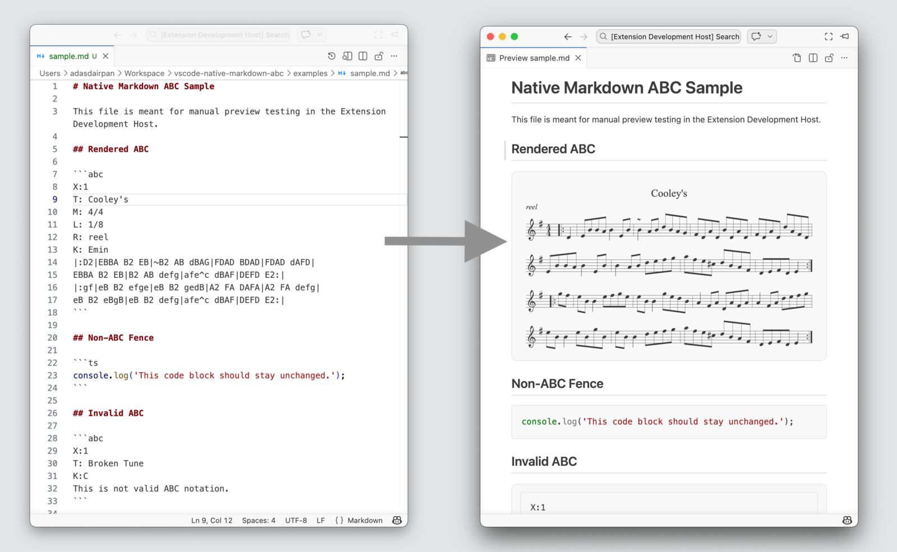

# Native Markdown ABC

Render ABC music notation directly inside VS Code's native Markdown preview.

## Preview



Native Markdown ABC turns fenced `abc` code blocks into rendered sheet music while keeping the normal Markdown authoring workflow intact.

## Why Use It

- Stay in the built-in Markdown preview instead of switching to a separate editor.
- Write ABC notation as plain text and see the rendered score immediately.
- Keep regular code blocks and Markdown content unchanged.
- Get clear fallback behavior when the ABC source is invalid.

## Usage

Write a fenced `abc` block in any Markdown file:

```md
~~~abc
X:1
T: Cooley's
M: 4/4
L: 1/8
R: reel
K: Emin
|:D2|EBBA B2 EB|~B2 AB dBAG|FDAD BDAD|FDAD dAFD|
EBBA B2 EB|B2 AB defg|afe^c dBAF|DEFD E2:|
~~~
```

Then open the standard Markdown preview in VS Code with `Markdown: Open Preview` or `Markdown: Open Preview to the Side`.

## What To Expect

- Supported syntax: fenced `abc` blocks only.
- Rendered notation appears inline in the native preview.
- Non-ABC fences stay as normal code blocks.
- Invalid ABC stays visible as source text and shows a compact error summary.

## Settings

The extension currently exposes three settings:

- `markdownAbc.enabled`: Turns ABC rendering on or off.
- `markdownAbc.responsive`: Controls whether the rendered score resizes with the preview pane.
- `markdownAbc.renderClassNames`: Adds abcjs CSS class names to the rendered SVG output.

## Install From VSIX

If you are distributing this manually instead of publishing to the Marketplace:

1. Build a `.vsix` package locally or download one from GitHub Actions artifacts.
2. In VS Code, run `Extensions: Install from VSIX...`.
3. Select the `.vsix` file.

## Package Locally

```sh
npm install
npm run compile
npm run package
```

This produces a `.vsix` file in the `artifacts/` directory that can be installed manually.

## Package In GitHub Actions

The repository includes a GitHub Actions workflow that builds and packages the extension as a `.vsix` artifact.

You can use it by:

1. Pushing to `main`.
2. Pushing a version tag such as `v0.0.2`.
3. Running the workflow manually from GitHub Actions.

After the workflow finishes, download the `.vsix` artifact from the workflow run page.

## Notes

- Fenced `abc` blocks only.
- Notation rendering only. Audio playback is not included.
- Best suited for desktop VS Code with the native Markdown preview.
